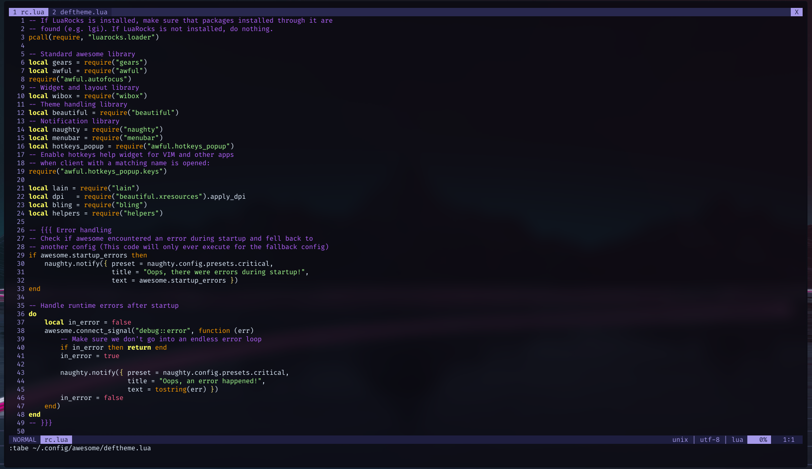

# VIM/NEOVIM Configuration

## Introduction

My NeoVim configuration stitched out of many others.

## Screenshot

## Plugins

### Theme

* [Shades of Purple](https://github.com/Rigellute/shades-of-purple.vim) - Current
* [Dogrun](https://github.com/Rigellute/shades-of-purple.vim) - Fallback
* [Badwolf](https://github.com/sjl/badwolf)
* [Badwolf for lightline](https://github.com/844196/lightline-badwolf.vim)
* [Vim Code Dark](https://github.com/tomasiser/vim-code-dark)
* [Chanllenger-Deep](https://github.com/challenger-deep-theme/vim)

### Tabline

### Productivity

### Fuzzy Finding

### Git

### Language Servers

### File Manager

### Vim Misc

## License

> Open source under the terms of [MIT LICENSE](https://opensource.org/licenses/MIT)
